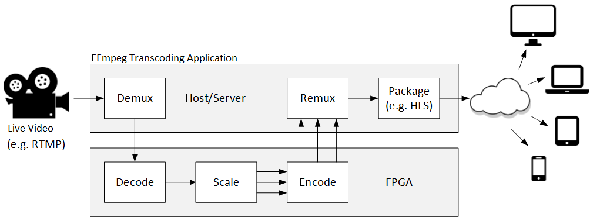

<table style="width:100%">
  <tr>
    <th width="100%" colspan="6"><h1>ABR Video Transcode</h2>
</th>
  </tr>
  <tr>
    <td align="center">1. Overview</td>
    <td align="center"><a href="vyusync-decoder.md">2. VYUsync Decoder</a></td>
    <td align="center"><a href="ngcodec-hevc-vp9-encoder.md">3. NGCodec HEVC and VP Encoder</a></td>
    <td align="center"><a href="xilinx-abr-scaler.md">4. Xilinx ABR Scaler</a></td>
    <td align="center"><a href="ffmpeg-integration.md">5. FFmpeg Integration</a></td>
    </tr>
    <tr>
    <td align="center"><a href="system-requirements.md">6. System Requirements</a></td>
    <td align="center"><a href="installation-and-getting-started.md">7. Installation and Getting Started</a></td>
    <td align="center"><a href="using-ffmpeg-with-xilinx.md">8. Using FFmpeg with Xilinx Accelerated Video Transcoding</a></td>
    <td align="center"><a href="known-issues-limitations.md">9. Known Issues and Limitations</a></td>
    <td align="center"><a href="additional-resources.md">10. Additional Resources</td>
  </tr>
</table>

## Introduction

ABR stands for adaptive bit rate streaming. It is a protocol for video streaming over HTTP where the source content is encoded at multiple bit rates and resolutions. This document describes the Xilinx video transcoding system that can accelerate ABR transcoding from H.264 to HEVC, or from H.264 to VP9. The system supports live video input streams of up to 1920x1080 at 60 frames per second.

## Overview
The streaming client is made aware of the available streams at differing bit rates. At the start, the client requests the lowest bit rate stream. If the client finds the download speed is greater than the bit rate of the stream, it requests the next higher bit rate. Later, if the client finds the download speed for a stream is lower than the bit rate (because the network throughput has deteriorated, for example) it requests a lower bit rate stream.

The three main functional parts of an ABR video transcoder are a decoder, a scaler, and an encoder. A typical transcoding pipeline works as follows:

 1. The original 1080p60 H.264 elementary stream is decoded.
 2. The scaler takes the uncompressed 1080p and produces multiple renditions of the content by scaling to resolutions of 720p, 480p, 320p, and 240p.
 3. These renditions are then encoded by a single instance of the VP9 (or HEVC) encoder by time division multiplexing the hardware.

Xilinx has integrated the video transcoding accelerators into FFmpeg. FFmpeg is an open source software project, containing a vast suite of libraries, plugins, and programs for handling video, audio, and other multimedia files and streams. The FFmpeg program itself, designed for command-line-based processing of video and audio files, is widely used for transcoding. FFmpeg is part of the workflow of many software projects, and its libraries are a core part of software media players such as VLC, for example.

The next sections provide more details on the following video transcoding accelerators:

* The H.264 video decoder provided by our partner [VYUsync](https://www.vyusync.com/).
* The [Xilinx](https://www.xilinx.com/) ABR scaler.
* The HEVC and VP9 encoders provided by our partner [NGCodec](https://ngcodec.com/).

:arrow_forward:**Next Topic:**  [2. VYUSync Decoder](vyusync-decoder.md)
