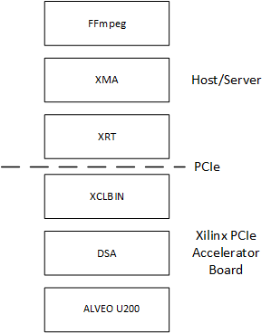
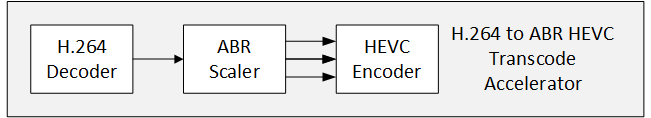
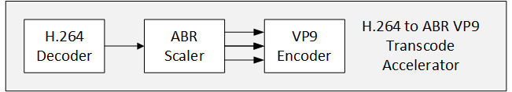

<table style="width:100%">
  <tr>
    <th width="100%" colspan="6"><h1>ABR Video Transcode (UG1311)</h2>
</th>
  </tr>
  <tr>
    <td align="center"><a href="README.md">1. Overview</a></td>
    <td align="center"><a href="vyusync-decoder.md">2. VYUsync Decoder</a></td>
    <td align="center"><a href="ngcodec-hevc-vp9-encoder.md">3. NGCodec HEVC and VP Encoder</a></td>
    <td align="center"><a href="xilinx-abr-scaler.md">4. Xilinx ABR Scaler</a></td>
    <td align="center">5. FFmpeg Integration</td>
    </tr>
    <tr>
    <td align="center"><a href="system-requirements.md">6. System Requirements</a></td>
    <td align="center"><a href="installation-and-getting-started.md">7. Installation and Getting Started</a></td>
    <td align="center"><a href="using-ffmpeg-with-xilinx.md">8. Using FFmpeg with Xilinx Accelerated Video Transcoding</a></td>
    <td align="center"><a href="known-issues-limitations.md">9. Known Issues and Limitations</a></td>
    <td align="center"><a href="additional-resources.md">10. Additional Resources</td>
  </tr>
</table>

# FFmpeg integration

Xilinx has integrated the video transcoding accelerators into FFmpeg. FFmpeg is one of the most popular frameworks for video transcoding. It allows for a seamless transition from running a transcoding flow in pure software on a host machine to offloading key CPU-intensive workloads (such as video decoding, ABR scaling, and HEVC or VP9 encoding) to a Xilinx accelerator card such as the **U200**. Depending on the host/server configuration, up to eight accelerator cards can be supported without stressing the CPU(s).

## System Architecture

The following diagram shows the anatomy of the layers of a host/server with a Xilinx accelerator card. Terminology is explained below.

* **Alveo U200**: The U200 data center accelerator card suitable for cloud or on-premise deployments. Application building is enabled through the [SDAccel™](https://www.xilinx.com/products/design-tools/software-zone/sdaccel.html) integrated environment.
* **Device Support Archive (DSA)**: The archive contains all of the design and metadata needed for a hardware function to interact with the physical design. It is the output product of the hardware platform design process described in this guide.
* **Xilinx Accelerator Binary (XCLBIN)**: Xilinx accelerator binary bitstreams are packaged in xclbin file format by the SDAccel compiler. Xilinx provides two xclbin accelerator binaries as part of the ABR video transcode evaluation package. One is a H.264 to ABR HEVC transcode accelerator, and the other is a H.264 to ABR VP9 transcode accelerator, as shown in the images below.

* **PCIe**: The Xilinx PCIe hardware device consists of two regions, the static region and the programmable region. The static region provides the connectivity framework to the programmable region, which executes the hardware functions as defined in the software kernel.
  * **Static Region**: Represents the fixed logic portion (contained in the DSA) of the programmable device that manages the design state before, during, and after partial reconfiguration of the device. This logic is not reimplemented with the programmable region.
  * **Programmable Region**: Describes the partition region that accepts the hardware functions from the SDAccel development environment. One at a time, xclbins are downloaded into the programmable region of the device.
* **Xilinx Runtime (XRT)** is implemented as a combination of user-space and kernel driver components. XRT, which supports both PCIe-based cards and  Zynq® UltraScale+™ MPSoCs, provides the software interface to the Xilinx accelerator card.
* **Xilinx Media Accelerator (XMA)**: The Xilinx Media Accelerator (XMA) library (`libxmaapi`) is a host interface that simplifies the development of applications managing and controlling video accelerators such as decoders, scalers, filters, and encoders. The `libxmaapi` library is comprised of two APIs: an application interface and a plugin interface. The application interface is a higher level, generalized interface intended for application developers responsible for integrating control of Xilinx accelerators into software frameworks such as FFmpeg, GStreamer, or proprietary frameworks. The plugin interface is a lower level interface intended for developers responsible for implementing hardware control of specific Xilinx acceleration kernels. In general, plugins are developed by kernel providers because they are specialized user-space drivers that are aware of the low-level hardware interface.
* **FFmpeg**: Xilinx has integrated the VYUsync H.264 decoder accelerator, the Xilinx ABR scaler accelerator, and the NGCodec HEVC and VP9 encoder accelerators into a fork of FFmpeg version 3.3. All source code is available from this [link](https://github.com/Xilinx/FFmpeg-xma) on GitHub.

## FFmpeg Command Line Application

In the following example, an FFmpeg command line is invoked that ingests a H.264 video elementary bitstream and reencodes the file as HEVC at a lower bit rate, targeting the Xilinx accelerated decoder and encoder. As a result, the `main()` function of the FFmpeg command is invoked and this calls the `xma_initialize()` function. The `xma_initialize()` function is called prior to executing any other XMA functions that handle resource management and control the Xilinx accelerators. The `xma_initialize()` function reads the system configuration file from `/tmp/ffmpeg_config.yml`. The XMA configuration file uses YAML syntax to describe how the system is to be configured. In this case, you can choose between a H.264 to ABR VP9 transcode configuration or a H.264 to ABR HEVC transcode configuration. The H.264 to ABR VP9 transcode configuration file is shown below.

	SystemCfg:
		- logfile:    /tmp/xma.log
		- loglevel:   2
		- dsa:        xilinx_u200_xdma_201820_1
		- pluginpath: /opt/xilinx/xma/plugins
		- xclbinpath: /opt/xilinx/xcdr/xclbins
		- ImageCfg:
			xclbin:   u200_h264dec_abr_vp9_ddr1.xclbin
			zerocopy: disable
			device_id_map: [0]
			KernelCfg: [[ instances: 1,
						  function: decoder,
						  plugin: libvyuh264.so,
						  vendor: VYUSync,
						  name: vyusync_h264_decoder_0,
						  ddr_map: [0]],
						[ instances: 1,
						  function: encoder,
						  plugin: libngcvp9.so,
						  vendor: NGCodec,
						  name: krnl_ngcodec_pistachio_enc,
						  ddr_map: [0]],
						[ instances: 1,
						  function: scaler,
						  plugin: libxabrscaler.so,
						  vendor: Xilinx,
						  name: v_abrscaler_top,
						  ddr_map: [1]]]

The configuration file tells FFmpeg, by way of `xma_initialize()`, which Xilinx accelerator binary (xclbin) should be loaded into the programmable region. It also communicates what the topology of the xclbin is in terms of the number of accelerators, what device memories they are using, and where to find the XMA software plugins.

No entries need to be modified in the above configuration file other than path names (`pluginpath` and `xclbinpath` tags) or file names (`logfile` tag). The other tags are tightly connected to the Xilinx accelerator binary listed after the `xclbin` tag.

One exception is the `device_id_map` tag which is listed to `[0]` in the above configuration file. This indicates that you are using only one Xilinx accelerator device. The `device_id_map tag` allows for a sequence of device identifiers to be supplied that is analogous to an array of integers. Device identifiers are zero relative, and the maximum allowed value is 15 for a total of 16 supported devices within a system. Given a server that can hold four Xilinx U200 accelerator cards, use the following setting:

`device_id_map: [0,1,2,3]`

All devices supplied in the sequence are then programmed by the `xma_initialize()` function with the xclbin specified in the `xclbin` tag. From an application and FFmpeg point of view, this means you can launch up to four FFmpeg command lines in parallel, each setting up a H.264 to ABR VP9 transcoding pipeline capable of running up to 1920x1080 at 60 frames per second.

When the `xma_initialize()` function successfully completes, the FFmpeg `main()` function performs initialization of all requested processing plugins. In this case, the Xilinx accelerated H.264 decoder and Xilinx accelerated VP9 encoder plugins have been registered with FFmpeg and the initialization callback of the plugin is invoked. The FFmpeg encoder plugin begins by creating an XMA session using the `xma_enc_session_create()` function. The `xma_enc_session_create()` function finds an available resource based on the properties supplied and, assuming resources are available, invokes the XMA plugin initialization function. The XMA plugin initialization function allocates any required input and output buffers on the device and performs initialization of the Xilinx accelerator if needed.

After initialization is complete, the FFmpeg plugin for the encoder uses the `xma_enc_session_send_frame()` function and the `xma_enc_session_recv_data()` function to send uncompressed frames and receive compressed data from the encoder accelerator. The FFmpeg plugin for the decoder uses the `xma_dec_session_send_data()` function and the `xma_dec_session_recv_frame()` function to send compressed data and receive uncompressed frames from the decoder accelerator.

More details on XMA can be found in the [Xilinx Media Accelerator (XMA) Developers Guide](https://gitenterprise.xilinx.com/ipssw/libxmaapi/wiki).

:arrow_backward:**Previous Topic:**  [4. Xilinx ABR Scaler](xilinx-abr-scaler.md)

:arrow_forward:**Next Topic:**  [6. System Requirements](system-requirements.md)
