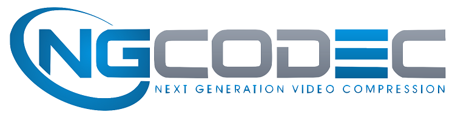

<table style="width:100%">
  <tr>
    <th width="100%" colspan="6"><h1>ABR Video Transcode</h2>
</th>
  </tr>
  <tr>
    <td align="center"><a href="README.md">1. Overview</a></td>
    <td align="center"><a href="vyusync-decoder.md">2. VYUsync Decoder</a></td>
    <td align="center">3. NGCodec HEVC and VP Encoder</td>
    <td align="center"><a href="xilinx-abr-scaler.md">4. Xilinx ABR Scaler</a></td>
    <td align="center"><a href="ffmpeg-integration.md">5. FFmpeg Integration</a></td>
    </tr>
    <tr>
    <td align="center"><a href="system-requirements.md">6. System Requirements</a></td>
    <td align="center"><a href="installation-and-getting-started.md">7. Installation and Getting Started</a></td>
    <td align="center"><a href="using-ffmpeg-with-xilinx.md">8. Using FFmpeg with Xilinx Accelerated Video Transcoding</a></td>
    <td align="center"><a href="known-issues-limitations.md">9. Known Issues and Limitations</a></td>
    <td align="center"><a href="additional-resources.md">10. Additional Resources</td>
  </tr>
</table>
# NGCodec HEVC and VP9 Encoder

NGCodec's RealityCodec™ is a broadcast-quality live distribution encoder for HEVC/VP9 with multiple ABR outputs. Running on Xilinx® FPGA instances in public clouds or customer data centers, the NGCodec encoder is an efficient way for OTT service providers and distributors, MSOs, and telephone companies to deliver the highest video quality at the lowest bit rates over the internet and other mediums. By leveraging the high-quality, high-density cloud platform to deliver the fewest bits, operators and service providers benefit immensely with a reduction in CAPEX and OPEX. The NGCodec encoder is readily integrated in FFmpeg and has flexible APIs for integration with other custom frameworks.

## Features

* High-quality live encoding
* Xilinx® FPGA accelerated encoding with no host CPU requirements
* 32 simultaneously independent encoded streams on a single Xilinx device
* Programmable latency of 1 to 4 seconds
* Simple API based on industry standards
* 4:2:0 8-bit and 10-bit with HDR on the roadmap
The encoder currently supports:

* Broadcast-quality 1080p60 HEVC/VP9 live encoding in a single Xilinx® Alveo U200 Data Center accelerator card suitable for cloud or on-premise deployments
* Built-in multipass encoding
* Flexible multiple ABR outputs with up to 32 streams with a single instance
* HEVC: Main 10 Profile up to Level 5.1 HD/SD 4:2:0 8-bit
* Constant bit rate (CBR), capped variable bit rate (VBR), and fixed QP modes
* Bit rates: Configurable from 100 Kbps to 40 Mbps
* Slice types: I, P, and B with flexible open/closed GOP modes and GOP lengths

## Benefits:

* 60 fps real-time encoding for resolutions up to 1920x1080 with better quality than x265 preset
* 10 times lower power consumption than CPU/GPU
* Support for HLS and DASH ABR outputs
* Consistent output quality independent of the number of encoding channels
* FFmpeg plugin

## Supported Encoding Tools:

* Advanced scene change detection algorithm
* Enhanced video pre-analysis with configurable look-ahead
* Coding tools: CABAC, deblocking Filter, SAO Filter, coding Units up to 64x64 pixels, adaptive transform sizes up to 32x32 pixels, adaptive quantization, all inter and intra modes with rate-distortion optimization (RDO)

## Supported Resolutions and Formats

* HD/SD resolutions down to 240p, with both horizontal and vertical dimension divisible by 4.
* 4:2:0 8-bit

For more information, please visit [www.ngcodec.com](https://www.ngcodec.com) or write to ian.jefferson@ngcodec.com.

:arrow_backward:**Previous Topic:**  [2. VYUsync Decoder](vyusync-decoder.md)

:arrow_forward:**Next Topic:**  [4. Xilinx ABR Scaler](xilinx-abr-scaler.md)
